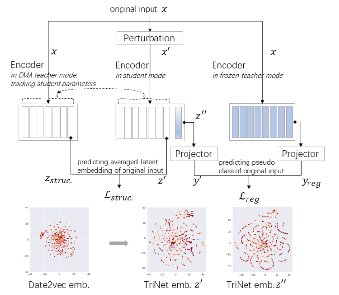

## TriNet: stabilizing self-supervised learning from complete or slow collapse on ASR

Code for our
paper "[TriNet: stabilizing self-supervised learning from complete or slow collapse on ASR](https://arxiv.org/abs/2301.00656)".

## Overview

We propose TriNet, which introduces a novel triple-branch architecture for preventing collapse and stabilizing the
pretraining.



## Installation

+ Pytorch

Please go to https://pytorch.org/ for pytorch installation, Our experiments are carried out under the environment of
pytorch 1.9 and cuda11.0

+ Install Flashlight Text

```shell
pip install flashlight-text
```

- Clone this repo

```shell
git clone https://github.com/tencent-ailab/trinet
```

+ Install fairseq and develop locally:

```shell
cd trinet
pip install --editable ./
```

## Get Start

Before the model starts training, you need to train another teacher model first. We provide four training scripts,
corresponding to the pre-training of the teacher model, the fine-tuning of the teacher model, the pre-training of the
TriNet, and the fine-tuning of the TriNet. You need to update ```task.data``` and ```task.data_list``` with your data
directory.

+ pretrain for teacher model

  ```shell
  sh shell/train_data2vec_pretrain.sh
  ```

+ finetune for teacher model

  Before the fine-tuning training starts, you need to update the ```model.w2v_path``` in the script to the path of the
  teacher model you trained before.

  ```shell
  sh shell/train_data2vec_finetune.sh
  ```

+ pretrain for Trinet

  Before TriNet training starts, you need to update the ```checkpoint.teacher_ckpt_path``` in the script to the path of the
  teacher model you trained before.

  ```shell
  sh shell/train_trinet_pretrain.sh
  ```

+ finetune for Trinet

  Before the fine-tuning training starts, you need to update the ```model.w2v_path``` in the script to the path of the
  teacher model you trained before.
  
  ```shell
  sh shell/train_trinet_finetune.sh
  ```
### Evaluating a CTC model:

Evaluating a CTC model with a language model requires [flashlight python bindings](https://github.com/facebookresearch/flashlight/tree/master/bindings/python) (previously called [wav2letter](https://github.com/facebookresearch/wav2letter) to be installed.)

Fairseq transformer language model used in the wav2vec 2.0 paper can be obtained from the [wav2letter model repository](https://github.com/facebookresearch/wav2letter/tree/master/recipes/sota/2019).
Be sure to upper-case the language model vocab after downloading it.

Letter dictionary for pre-trained models can be found [here](https://dl.fbaipublicfiles.com/fairseq/wav2vec/dict.ltr.txt).

Next, run the evaluation command:

```shell script
python examples/speech_recognition/new/infer.py --config-dir examples/speech_recognition/new/conf \
--config-name infer task=audio_finetuning task.data=/path/to/manifests common.user_dir=examples/data2vec \
task.labels=ltr decoding.type=kenlm \
decoding.lmweight=${lmweight} decoding.wordscore=${wordscore} decoding.silweight=${silscore} \
decoding.lexicon=/path/to/lexicon \
decoding.lmpath=/path/to/lm decoding.unique_wer_file=True \
dataset.gen_subset=dev_clean,dev_other,test_clean,test_other \
common_eval.path=/path/to/checkpoint.pt decoding.beam=1500 distributed_training.distributed_world_size=${num_gpus}
```

## Performance Benchmark

We evaluate our model on the public Librispeech dev/test sets when training on the LS-100h labeled. WER (%) results are
listed below. It is worth noting that the data input format of **Wav2vec 2.0** and **Hubert** is **wavform**, and the data input format of **Data2vec** and **TriNet** is **fbank**.

| Model       | dev-clean | dev-other | test-clean | test-other |
|-------------|-----------|-----------|------------|------------|
| Wav2vec 2.0 | 2.7       | 7.9       | 3.4        | 8.0        |
| Hubert      | 2.6       | 7.8       | 3.4        | 8.1        |
| Data2vec    | 2.61      | 6.79      | 3.09       | 7.07       |
| TriNet      | 2.45      | 6.79      | 2.88       | 6.48       |


## License

Copyright 2022 Tencent

Licensed under the Apache License, Version 2.0 (the "License");
you may not use this file except in compliance with the License.
You may obtain a copy of the License at

       http://www.apache.org/licenses/LICENSE-2.0

Unless required by applicable law or agreed to in writing, software
distributed under the License is distributed on an "AS IS" BASIS,
WITHOUT WARRANTIES OR CONDITIONS OF ANY KIND, either express or implied.
See the License for the specific language governing permissions and
limitations under the License.

## References ##

[1] [Data2vec: A general framework for self-supervised learning in speech, vision and language](https://proceedings.mlr.press/v162/baevski22a.html),
Baevski, A., Hsu, W. N., Xu, Q., Babu, A., Gu, J., & Auli, M. 2022

[2] [TriNet: stabilizing self-supervised learning from complete or slow collapse](https://ieeexplore.ieee.org/abstract/document/10094725),
Cao, Lixin and Wang, Jun and Yang, Ben and Su, Dan and Yu, Dong 2023

[3] [fairseq: A Fast, Extensible Toolkit for Sequence Modeling](https://aclanthology.org/N19-4009/), Myle Ott and Sergey
Edunov and Alexei Baevski and Angela Fan and Sam Gross and Nathan Ng and David Grangier and Michael Auli 2019

## Citation

```tex
@inproceedings{baevski2022data2vec,
  title={Data2vec: A general framework for self-supervised learning in speech, vision and language},
  author={Baevski, Alexei and Hsu, Wei-Ning and Xu, Qiantong and Babu, Arun and Gu, Jiatao and Auli, Michael},
  booktitle={International Conference on Machine Learning},
  pages={1298--1312},
  year={2022},
  organization={PMLR}
}

@inproceedings{cao2023trinet,
  title={TriNet: stabilizing self-supervised learning from complete or slow collapse},
  author={Cao, Lixin and Wang, Jun and Yang, Ben and Su, Dan and Yu, Dong},
  booktitle={ICASSP 2023-2023 IEEE International Conference on Acoustics, Speech and Signal Processing (ICASSP)},
  pages={1--5},
  year={2023},
  organization={IEEE}
}

@inproceedings{ott2019fairseq,
  title = {fairseq: A Fast, Extensible Toolkit for Sequence Modeling},
  author = {Myle Ott and Sergey Edunov and Alexei Baevski and Angela Fan and Sam Gross and Nathan Ng and David Grangier and Michael Auli},
  booktitle = {Proceedings of NAACL-HLT 2019: Demonstrations},
  year = {2019},
}
```

## Disclaimer ##

This is not an officially supported Tencent product
